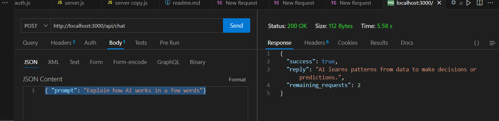

## for redis
docker run -p 6379:6379 -it redis/redis-stack-server:latest

create a .env file
 add `GOOGLE_GENERATIVE_AI_API_KEY={gemini-api-key}`

### RUN server
    nodemon server.js

### login api
    endpoint: http://localhost:3000/api/login
    body: {"id": 333, "role": "premium"}
    output: 

### get status api
    endpoint: http://localhost:3000/api/status
    headers : 
            authorization : `Bearer ${JWT}` || null
    output: 

### basic get api
    endpoint: http://localhost:3000/geminiAi-integration/
    headers : 
            authorization : `Bearer ${JWT}` || null
    output: 

### chat api    
    endpoint: http://localhost:3000/api/chat
    headers : 
            authorization : `Bearer ${JWT}` || null
    body: { "prompt": "Explain how AI works in a few words"}

    output : 
